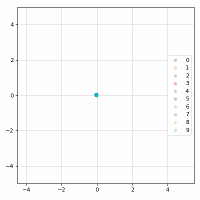
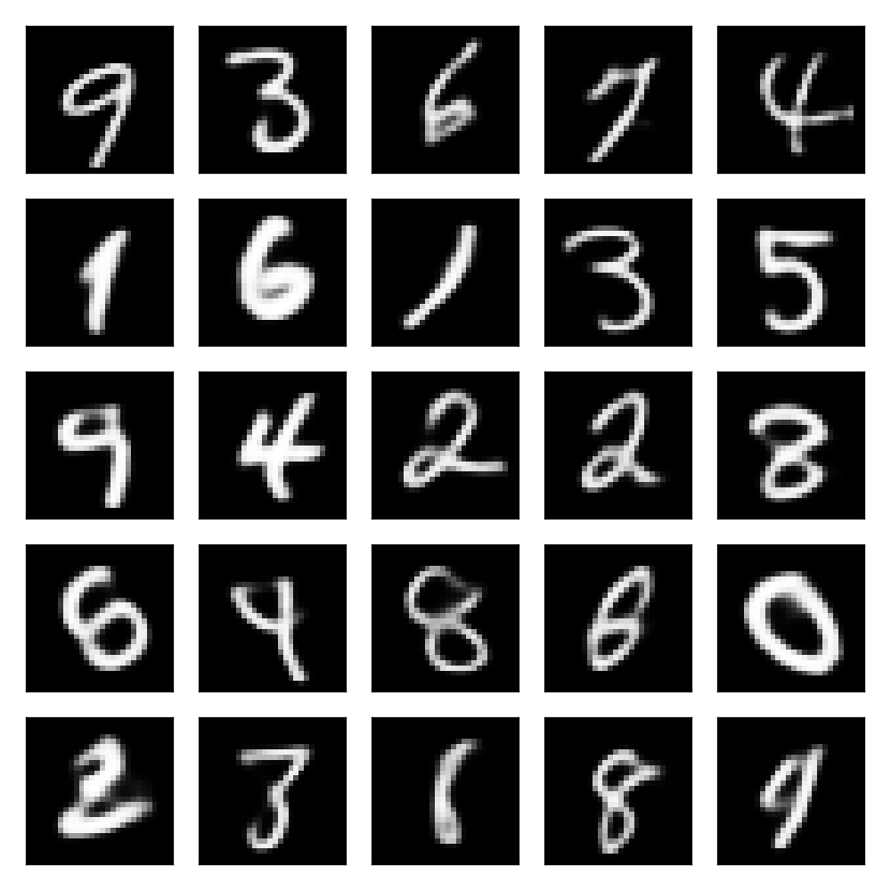

# Introduction to variational autoencoders

<p>
  
  
</p>

This project provides an experimentation environment for VAE algorithms.
They can be used for generative modeling and representation learning.
The models are implemented in PyTorch and trained with Lightning.
Application examples based on MNIST and CIFAR-10 are provided.

## Installation

```
pip install -e .
```

## Training

```
python scripts/main.py fit --config config/mnist_dense.yaml
```

```
python scripts/main.py fit --config config/mnist_conv.yaml
```

```
python scripts/main.py fit --config config/cifar10.yaml
```

## Notebooks

- [Introduction](notebooks/intro.ipynb)

- [Bernoulli VAEs for MNIST](notebooks/mnist.ipynb)

- [Gaussian VAE for CIFAR-10](notebooks/cifar10.ipynb)

